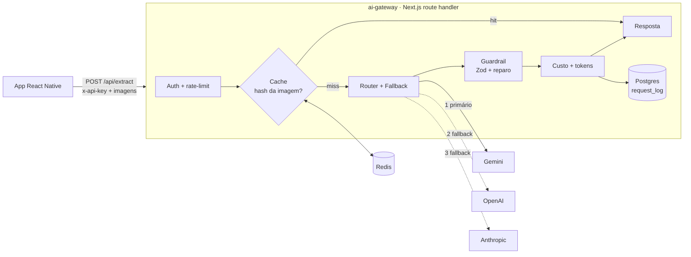

# DailyNutry

App de nutrição que transforma a **foto de um plano alimentar impresso** (do
software Dietbox) em um plano interativo — com substituições, modo cozinha e
cálculo cru→pronto. O núcleo é OCR + IA: extrair JSON estruturado e confiável de
uma imagem.

Monorepo com duas partes:

| Pasta | O quê | Stack |
|---|---|---|
| [`dailynutry-app/`](dailynutry-app) | App mobile | Expo / React Native + TypeScript |
| [`ai-gateway/`](ai-gateway) | Gateway de IA | Node.js + TypeScript · Next.js · Postgres · Redis |

---

## Histórico de engenharia

**v1.** O app chamava o Gemini direto do celular, com a API key do próprio
usuário, e fazia `JSON.parse` cru na resposta. Rápido, mas a key ficava exposta
no client, não havia validação do output, nem fallback, nem visibilidade de
custo.

**v2.** A orquestração de IA foi movida para o `ai-gateway/`, um serviço Node/TS
que esconde as chaves, abstrai providers (Gemini, OpenAI, Anthropic) atrás de
uma interface única, faz fallback quando o primário falha, valida o output
(Zod + loop de reparo) e mede custo/latência por request. O app usa o gateway
quando configurado e cai no caminho Gemini-direto como fallback.

---

## Arquitetura do gateway



Por request: auth (`x-api-key`) → rate-limit → cache por hash da imagem →
router com fallback → guardrail (valida contra Zod; em falha, reparo text-only)
→ custo (tokens × tabela de preço versionada) → persiste o log e responde.

**Por que Next.js (e não um serviço standalone):** bate a stack de Node/TS +
Postgres + Redis e coloca o dashboard de observabilidade no mesmo deploy.
Roda como Node server long-running (`runtime = 'nodejs'`), necessário pelo pool
do Postgres e cliente Redis.

### Onde cada coisa está

| Recurso | Arquivo |
|---|---|
| Abstração de providers | [`core/provider.ts`](ai-gateway/src/core/provider.ts) · [`providers/`](ai-gateway/src/providers) |
| Fallback entre providers | [`core/orchestrator.ts`](ai-gateway/src/core/orchestrator.ts) · [`core/config.ts`](ai-gateway/src/core/config.ts) |
| Validação + reparo do output | [`core/guardrail.ts`](ai-gateway/src/core/guardrail.ts) · [`core/schema.ts`](ai-gateway/src/core/schema.ts) |
| Custo / tokens | [`core/pricing.ts`](ai-gateway/src/core/pricing.ts) · [`core/cost.ts`](ai-gateway/src/core/cost.ts) |
| Cache + rate-limit | [`cache/redis.ts`](ai-gateway/src/cache/redis.ts) |
| Observabilidade | [`db/request-log.ts`](ai-gateway/src/db/request-log.ts) · [`app/dashboard`](ai-gateway/src/app/dashboard) |

---

## Decisões e trade-offs

- **Adapters em `fetch` cru, sem SDK.** Mantém os adapters próximos do contrato
  REST de cada provider e sem dependências extras. OpenAI e Anthropic estão
  implementados mas ainda não validados contra key real (só há key do Gemini);
  ativam ao preencher o `.env`.
- **Reparo estrutural usa modelo de texto, não visão.** A chamada de visão roda
  uma vez. Quando o Zod reprova (enum inválido, campo faltando, JSON malformado),
  o reparo reenvia só o texto quebrado e o erro de validação. Corrige a forma do
  JSON, não a leitura da imagem.
- **Fallback distingue erro retryável de fail-fast.** Timeout/5xx/429 → próximo
  provider. 4xx → falha imediata, para não repetir um request inválido contra a
  quota de outro provider.
- **Auth + rate-limit + cache.** Com as chaves no servidor, o gateway passa a
  arcar com o custo das chamadas; auth e rate-limit limitam o uso, e o cache por
  hash evita reprocessar a mesma imagem.
- **Custo é estimativa.** Tabela de preço versionada (`PRICING_VERSION`). Modelo
  sem preço conhecido → custo `null`, em vez de um valor inventado.
- **Degradação graciosa.** Sem `DATABASE_URL`, os logs vão para stdout. Sem
  `REDIS_URL`, cache e rate-limit viram no-op. O gateway roda sem infra externa.

---

## Rodando

```bash
# Gateway
cd ai-gateway
cp .env.example .env            # preencha GEMINI_API_KEY e GATEWAY_API_KEY
npm install
docker compose up -d            # opcional: Postgres + Redis
npm run db:init                 # opcional: cria a tabela request_log
npm run dev                     # http://localhost:4000

# App
cd ../dailynutry-app
npm install
npm start
```

No app, **Configurações → Gateway de IA**: informe a URL (ex.:
`http://SEU_IP:4000`) e o `x-api-key`. Se preenchido, o app usa o gateway; senão
cai no Gemini direto.

Cada resposta traz, em `meta`: `attempts` (trace por provider), `fallbackReason`
quando um fallback respondeu, `repairs`, `cost` e `latencyMs`.

Sem nenhuma key de provider configurada, `/api/extract` responde **503** (`No LLM
provider configured`) — o gateway não devolve dado fabricado. O fallback entre
providers só ocorre, e só é demonstrável, com ≥2 keys reais; o comportamento do
router e dos guardrails é coberto pelos testes.

---

## Status

- ✅ Provider abstraction + fallback
- ✅ Guardrails (Zod + reparo)
- ✅ Custo + observabilidade (Postgres + dashboard)
- ⏳ Adapters OpenAI/Anthropic implementados, ainda não validados contra key real
- ⏳ Planejado: RAG (tabela TACO) + normalização cru→pronto
