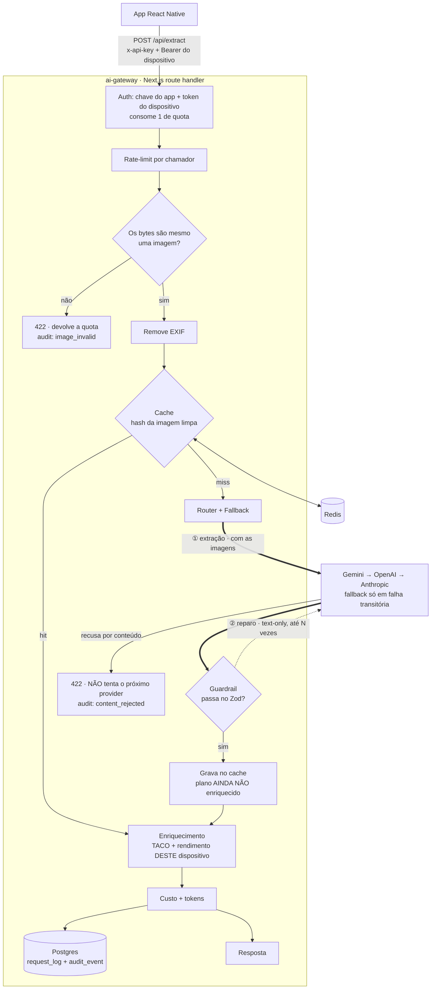

# DailyNutry

App de nutrição que transforma a **foto de um plano alimentar impresso** (do
software Dietbox) em um plano interativo — com substituições, modo cozinha e
cálculo cru→pronto. O núcleo é OCR + IA: extrair JSON estruturado e confiável de
uma imagem.

Monorepo com duas partes:

| Pasta | O quê | Stack |
|---|---|---|
| [`dailynutry-app/`](dailynutry-app) | App mobile | Expo / React Native + TypeScript |
| [`ai-gateway/`](ai-gateway) | Gateway de IA | Node.js + TypeScript · Next.js · Postgres · Redis |

---

## Histórico de engenharia

**v1.** O app chamava o Gemini direto do celular, com a API key do próprio
usuário, e fazia `JSON.parse` cru na resposta. Rápido, mas a key ficava exposta
no client, não havia validação do output, nem fallback, nem visibilidade de
custo.

**v2.** A orquestração de IA foi movida para o `ai-gateway/`, um serviço Node/TS
que esconde as chaves, abstrai providers (Gemini, OpenAI, Anthropic) atrás de
uma interface única, faz fallback quando o primário falha, valida o output
(Zod + loop de reparo) e mede custo/latência por request. O app usa o gateway
quando configurado e cai no caminho Gemini-direto como fallback.

---

## Arquitetura do gateway



**Duas idas à LLM, não uma.** A seta ① leva as imagens para a extração; a ②
é o loop de reparo do guardrail, uma chamada *text-only* que devolve o JSON
inválido e o erro de validação ao mesmo provider que respondeu, até
`MAX_REPAIR_ATTEMPTS`. O guardrail não recebe nada do router: ele julga a
**resposta do provider**, e é por isso que a seta volta.

**Recusa de conteúdo não é fallback.** Uma falha transitória (503, timeout)
desce a cadeia para o próximo provider. Uma recusa por política de conteúdo
para na hora — todo provider aplica política equivalente, então insistir só
distribuiria o mesmo material por todas as contas, pagando cada recusa.

**O cache guarda o plano antes do enriquecimento.** Enriquecer depende de quem
chama (cada dispositivo vê as próprias correções de rendimento), então cachear
o resultado enriquecido serviria os números de um usuário para o seguinte. O
caro é a extração; enriquecer de novo custa duas queries — por isso o caminho
de *hit* também passa pelo enriquecimento.

Por request: auth (chave do app + token do dispositivo + quota) → rate-limit →
validação da imagem (magic bytes, dimensões, EXIF) → cache por hash → router
com fallback → guardrail (Zod; em falha, reparo text-only) → enriquecimento
(TACO + rendimento) → custo (tokens × tabela de preço versionada) → persiste
log e auditoria, e responde.

**Por que Next.js (e não um serviço standalone):** bate a stack de Node/TS +
Postgres + Redis e coloca o dashboard de observabilidade no mesmo deploy.
Roda como Node server long-running (`runtime = 'nodejs'`), necessário pelo pool
do Postgres e cliente Redis.

### Onde cada coisa está

| Recurso | Arquivo |
|---|---|
| Abstração de providers | [`core/types.ts`](ai-gateway/src/core/types.ts) · [`providers/`](ai-gateway/src/providers) |
| Fallback entre providers | [`core/orchestrator.ts`](ai-gateway/src/core/orchestrator.ts) · [`core/config.ts`](ai-gateway/src/core/config.ts) |
| Validação + reparo do output | [`core/guardrail.ts`](ai-gateway/src/core/guardrail.ts) · [`core/schema.ts`](ai-gateway/src/core/schema.ts) |
| Custo / tokens | [`core/pricing.ts`](ai-gateway/src/core/pricing.ts) · [`core/cost.ts`](ai-gateway/src/core/cost.ts) |
| Cache + rate-limit | [`cache/redis.ts`](ai-gateway/src/cache/redis.ts) |
| Auth de dispositivo + quota | [`core/device-auth.ts`](ai-gateway/src/core/device-auth.ts) · [`db/device.ts`](ai-gateway/src/db/device.ts) |
| Validação de imagem + EXIF | [`core/image-validation.ts`](ai-gateway/src/core/image-validation.ts) |
| Política de conteúdo + bloqueio | [`core/content-policy.ts`](ai-gateway/src/core/content-policy.ts) · [`db/device-block.ts`](ai-gateway/src/db/device-block.ts) |
| Enriquecimento TACO / rendimento | [`core/enrichment.ts`](ai-gateway/src/core/enrichment.ts) · [`db/taco.ts`](ai-gateway/src/db/taco.ts) · [`db/yield.ts`](ai-gateway/src/db/yield.ts) |
| Observabilidade | [`db/request-log.ts`](ai-gateway/src/db/request-log.ts) · [`app/dashboard`](ai-gateway/src/app/dashboard) |
| Auditoria (suporte / investigação) | [`db/audit.ts`](ai-gateway/src/db/audit.ts) |
| Pipeline de supply-chain | [`scripts/supply-chain-check.mjs`](scripts/supply-chain-check.mjs) · [`SECURITY.md`](SECURITY.md) |

---

## Decisões e trade-offs

- **Adapters em `fetch` cru, sem SDK.** Mantém os adapters próximos do contrato
  REST de cada provider e sem dependências extras. OpenAI e Anthropic estão
  implementados mas ainda não validados contra key real (só há key do Gemini);
  ativam ao preencher o `.env`.
- **Reparo estrutural usa modelo de texto, não visão.** A chamada de visão roda
  uma vez. Quando o Zod reprova (enum inválido, campo faltando, JSON malformado),
  o reparo reenvia só o texto quebrado e o erro de validação. Corrige a forma do
  JSON, não a leitura da imagem.
- **Fallback distingue erro retryável de fail-fast.** Timeout/5xx/429 → próximo
  provider. 4xx → falha imediata, para não repetir um request inválido contra a
  quota de outro provider.
- **Duas credenciais, com papéis diferentes.** A chave do app (`x-api-key`) diz
  "isto é o DailyNutry" — viaja dentro do binário, então é um portão fraco, não
  uma identidade. O token de dispositivo (`Bearer`) diz "isto é a instalação
  #1234": único por install, revogável, com quota diária. Rate-limit e quota
  penduram no token, então uma chave de app vazada não compra mais extração
  ilimitada.
- **Custo é estimativa.** Tabela de preço versionada (`PRICING_VERSION`). Modelo
  sem preço conhecido → custo `null`, em vez de um valor inventado.
- **Falha aberta e falha fechada são escolhas separadas.** Sem `DATABASE_URL`,
  os logs vão para stdout. Sem `REDIS_URL`, o cache vira no-op — perder cache
  custa dinheiro, não segurança. Mas o **rate-limit nunca** vira no-op: sem
  Redis ele cai num limitador em processo, e quando não consegue decidir, nega.
  Um limitador que se desliga sozinho ao perder a infra é exatamente o que um
  atacante provoca de propósito.

---

## Rodando

```bash
# Gateway
cd ai-gateway
cp .env.example .env            # preencha GEMINI_API_KEY e GATEWAY_API_KEY
npm install
docker compose up -d            # Postgres + Redis
npm run db:init                 # cria o schema e popula TACO + rendimentos
npm run dev                     # http://localhost:4000

# App
cd ../dailynutry-app
npm install
npm start
```

Postgres deixou de ser opcional: `device`, `yield_override`, `audit_event` e
`device_block` sustentam auth de dispositivo, quota e auditoria. Sem banco, o
registro de dispositivo responde 503 em vez de emitir um token que o gateway não
teria como verificar nem revogar depois.

No app, **Configurações → Gateway de IA**: informe a URL (ex.:
`http://SEU_IP:4000`) e o `x-api-key`. Se preenchido, o app usa o gateway; senão
cai no Gemini direto. O token de dispositivo é obtido sozinho na primeira
chamada e guardado no keychain/keystore — não há nada a configurar.

Cada resposta traz, em `meta`: `attempts` (trace por provider), `fallbackReason`
quando um fallback respondeu, `repairs`, `cost` e `latencyMs`.

Sem nenhuma key de provider configurada, `/api/extract` responde **503** (`No LLM
provider configured`) — o gateway não devolve dado fabricado. O fallback entre
providers só ocorre, e só é demonstrável, com ≥2 keys reais; o comportamento do
router e dos guardrails é coberto pelos testes.

---

## Qualidade

```bash
git config core.hooksPath .githooks   # habilita o gate de pre-commit (uma vez)
```

O hook em [`.githooks/pre-commit`](.githooks/pre-commit) roda typecheck, lint e
testes apenas no(s) projeto(s) com mudanças staged, e **bloqueia o commit** se
algo falhar. Quando o `package.json`, o lockfile ou o `.npmrc` mudam, roda
também o `supply-chain` — só nesse caso, porque ele vai à rede.

- **Gateway:** `typecheck` · `lint` · `test` (83 unitários, tudo externo
  mockado) · `test:integration` (48 contra Postgres real).
- **App:** `typecheck` · `lint` · `test` (18).

**Por que duas suítes.** A unitária é hermética e roda sem Docker. A de
integração existe porque mock esconde exatamente a costura onde os dois bugs
reais moraram — um off-by-one de quota e uma direção invertida de busca, ambos
em SQL. O primeiro tinha teste unitário **verde afirmando o número errado**.

CI em [`.github/workflows/`](.github/workflows): `ci.yml` (ambos os projetos,
com Postgres em service container), `codeql.yml` (SAST) e
`dependency-review.yml`. A política de dependências está em
[`SECURITY.md`](SECURITY.md).

## Status

- ✅ Provider abstraction + fallback
- ✅ Guardrails (Zod + reparo)
- ✅ Custo + observabilidade (Postgres + dashboard)
- ✅ RAG TACO + normalização cru→pronto, com override por dispositivo
- ✅ Auth de dispositivo, quota diária, revogação e bloqueio temporário
- ✅ Validação de imagem, remoção de EXIF e política de conteúdo
- ✅ Auditoria e pipeline de supply-chain no CI
- ⏳ Adapters OpenAI/Anthropic implementados, ainda não validados contra key real
- ⏳ Ordem de páginas derivada do conteúdo; detecção de "não é plano alimentar"
